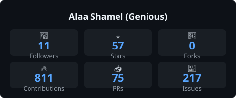
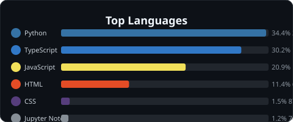

<h1 align="center">
  
</h1>

 

  

  <strong>Full-Stack Software Engineer</strong>
  &nbsp;·&nbsp;
  <strong>AI &amp; Intelligent Systems</strong>
  &nbsp;·&nbsp;
  <strong>Product Engineering</strong>

  <em>
    Building modern software with clean architecture, scalable backend systems,
    and practical AI.
  </em>

 

  
  &nbsp;
  
  &nbsp;
  

  
  &nbsp;
  

 

 

## About Me

<table>
<tr>

<td width="66%" valign="middle">

I'm a <strong>Full-Stack Software Engineer</strong> from <strong>Giza, Egypt</strong>,
focused on building software that combines solid engineering with useful products.

I work across the stack — from frontend interfaces and backend APIs to databases,
authentication, deployment, and AI-powered features.

My approach is centered around
<strong>clean architecture</strong>,
<strong>maintainable code</strong>,
<strong>scalable systems</strong>,
and <strong>practical AI</strong>.

I enjoy taking ideas from an initial concept and turning them into structured,
usable products.

</td>

<td width="34%" align="center" valign="middle">

  

Software Engineering 
AI Integration 
Product Development

</td>

</tr>
</table>

 

  

 

---

## Selected Work

<table>
<tr>

<td width="50%" valign="top">

### AI Document Assistant

AI-powered document understanding and retrieval system designed to turn large document collections into searchable, context-aware knowledge.

**Focus:** `RAG` · `AI` · `Search` · `Full-Stack`

 

<a href="https://github.com/Alaashamel/AI-doc-Chatbot">
  View Repository →
</a>

</td>

<td width="50%" valign="top">

### Connectify

A full-stack social platform covering authentication, profiles, content sharing, communication, and modern backend services.

**Focus:** `MERN` · `REST APIs` · `Auth` · `Real-Time`

 

<a href="https://github.com/Alaashamel/Connectify-Social-Media-Platform">
  View Repository →
</a>

</td>

</tr>

<tr>

<td width="50%" valign="top">

### AI Web Operating System

An AI-powered web application concept exploring intelligent interfaces, productivity workflows, and modern application architecture.

**Focus:** `AI` · `TypeScript` · `Product Engineering`

 

<a href="https://github.com/Alaashamel/AI-Web-Operating-System">
  View Repository →
</a>

</td>

<td width="50%" valign="top">

### Pixel Kingdom

A browser-based game project exploring world design, gameplay systems, interactive mechanics, and modular game architecture.

**Focus:** `React` · `Phaser` · `Game Systems`

 

<a href="https://github.com/Alaashamel/pixel-kingdom-survival-rpg">
  View Repository →
</a>

</td>

</tr>

<tr>

<td width="50%" valign="top">

### AI Real Estate Analyzer

A data-driven application focused on analyzing real-estate information and extracting useful insights for property-related decision making.

**Focus:** `Python` · `Data Analysis` · `AI`

 

<a href="https://github.com/Alaashamel/ai_real_state_analyzer">
  View Repository →
</a>

</td>

<td width="50%" valign="top">

### Roadmap Explorer

An interactive learning platform built around structured technology roadmaps and guided learning paths.

**Focus:** `JavaScript` · `Web Development` · `Product UX`

 

<a href="https://github.com/Alaashamel/Roadmap-Explorer">
  View Repository →
</a>

</td>

</tr>
</table>

 

<strong>Explore more projects</strong>

 

- [Real Estate Analyzer](https://github.com/Alaashamel/real_estate_analyzer)
- [Stock Market Platform](https://github.com/Alaashamel/Stock.Market.platform)
- [Help-Link](https://github.com/Alaashamel/Help-Link)
- [SkillBridge](https://github.com/Alaashamel/SkillBridge)
- [E-Commerce Project](https://github.com/Alaashamel/1st-phase-e-commerece)
- [R & Python Final Edition](https://github.com/Alaashamel/R-PY_FINAL_EDITION_PR)

 

 

## What I Build

<table>
<tr>

<td width="33%" valign="top">

### Full-Stack Systems

Complete web applications with modern interfaces, structured APIs, authentication, databases, dashboards, and scalable architecture.

 

`React` · `Next.js` · `Node.js`

</td>

<td width="33%" valign="top">

### AI-Powered Applications

Practical AI systems combining machine learning, computer vision, NLP, and intelligent workflows with real applications.

 

`Python` · `TensorFlow` · `OpenCV`

</td>

<td width="33%" valign="top">

### Product Engineering

Turning ideas into maintainable products through clean structure, reliable backend logic, testing, deployment, and thoughtful UX.

 

`Docker` · `Git` · `CI/CD`

</td>

</tr>
</table>

 

---

## Technology Stack

### Frontend

  

### Backend &amp; APIs

  

### Databases

  

### AI &amp; Engineering

 

React · Next.js · JavaScript · Node.js · Express · Python · FastAPI ·
MongoDB · PostgreSQL · MySQL · Redis · Docker · Git

 

 

## Current Focus

<table>
<tr>

<td width="33%" valign="top">

### Full-Stack Engineering

Building production-oriented applications with React, Next.js, Node.js, APIs, authentication, databases, and structured architecture.

</td>

<td width="33%" valign="top">

### AI &amp; Intelligent Systems

Exploring machine learning, deep learning, NLP, computer vision, and practical AI integration into real products.

</td>

<td width="33%" valign="top">

### Production Engineering

Improving software quality through testing, Docker, CI/CD, deployment, Git workflows, and maintainable systems.

</td>

</tr>
</table>

 

  

 

---

## GitHub Activity

  

 

  

 

<table align="center">
<tr>

<td width="50%" align="center" valign="middle">

</td>

<td width="50%" align="center" valign="middle">

</td>

</tr>
</table>

 

 

## Let's Connect

 

&nbsp;

  

<em>
Build with purpose · Engineer with clarity · Ship something useful
</em>

  

  

